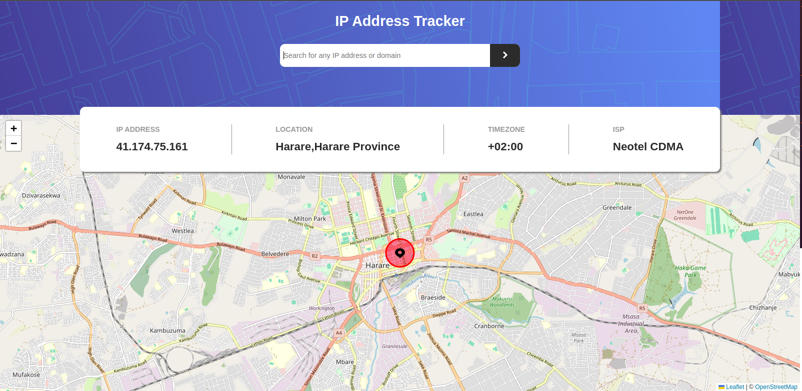

# Frontend Mentor - IP address tracker solution

This is a solution to the [IP address tracker challenge on Frontend Mentor](https://www.frontendmentor.io/challenges/ip-address-tracker-I8-0yYAH0). Frontend Mentor challenges help you improve your coding skills by building realistic projects. 

## Table of contents

- [Overview](#overview)
  - [The challenge](#the-challenge)
  - [Screenshot](#screenshot)
  - [Links](#links)
- [My process](#my-process)
  - [Built with](#built-with)
  - [Useful resources](#useful-resources)
- [Author](#author)

**Note: Delete this note and update the table of contents based on what sections you keep.**

## Overview

Solution to Frontend Mentor IP Address Tracker

### The challenge

Users should be able to:

- View the optimal layout for each page depending on their device's screen size
- See hover states for all interactive elements on the page
- See their own IP address on the map on the initial page load
- Search for any IP addresses or domains and see the key information and location

### Screenshot

### Links

- Solution URL: [Github](https://github.com/Taku-chimanaz/ip-address-tracker)
- Live Site URL: [Add live site URL here](https://your-live-site-url.com)

## My process

### Built with

- Semantic HTML5 markup
- CSS custom properties
- Flexbox
- CSS Positioning
- [React](https://reactjs.org/) - JS library

### Useful resources

- [4 reasons your z-index isn’t working (and how to fix it)](https://coder-coder.com/z-index-isnt-working/) - This solution helped me in understanding why z-index might not work.

## Author

- Frontend Mentor - [@Taku-Chimanaz](https://www.frontendmentor.io/profile/Taku-chimanaz)
- Twitter - [@tk_cypher](https://www.twitter.com/tk_cypher)

